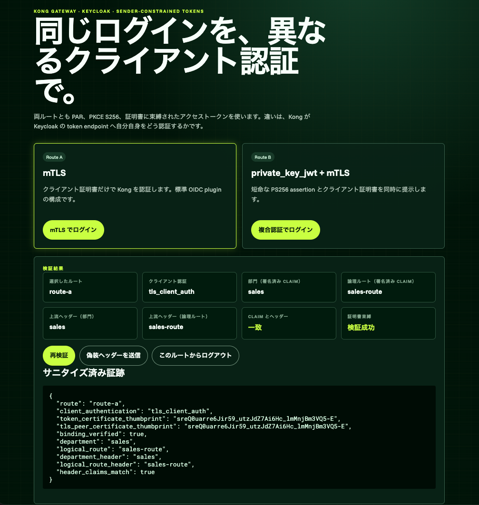
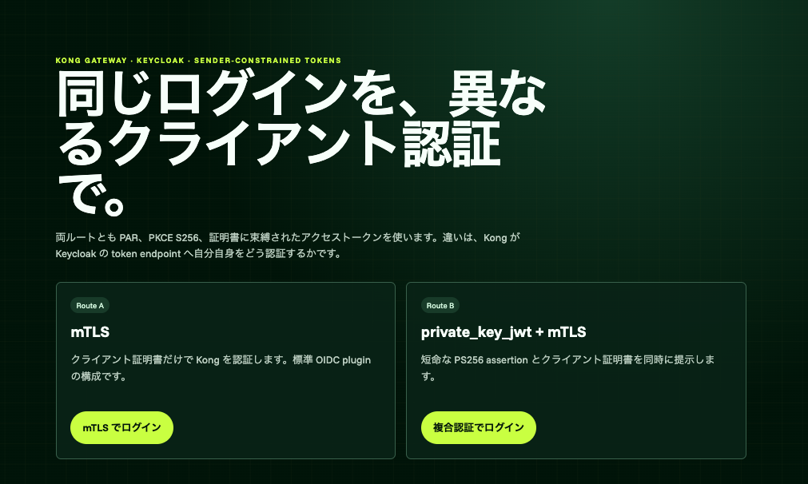
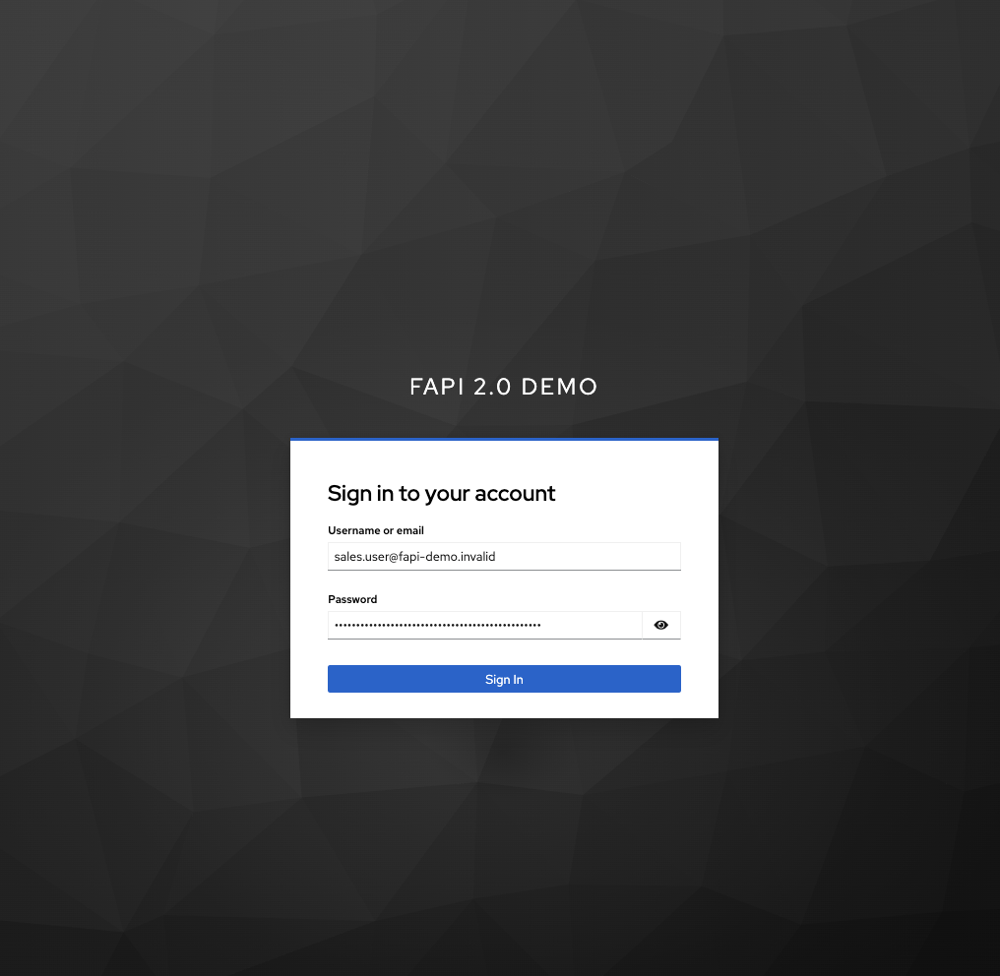

# Keycloak FAPI 2.0 クライアント認証デモ

Kong Gateway 3.16 を Konnect の data plane として動かし、同じ Keycloak realm に対する二つの OAuth クライアント認証方式を比較するローカルデモです。

| ルート | パス | token endpoint のクライアント認証 |
| --- | --- | --- |
| Route A | `/api/fapi/mtls` | `tls_client_auth` |
| Route B | `/api/fapi/pkj-mtls` | `private_key_jwt`（PS256）+ mTLS |

両ルートで PAR、PKCE S256、短命な認可コード、証明書に束縛されたアクセストークンを要求します。Upstream の PoP verifier は JWT の署名・issuer・audience・時刻・scope と、`cnf.x5t#S256` が実際の TLS peer 証明書に一致することを確認します。

> このリポジトリは FAPI 2.0 の学習・比較用デモです。認定試験への適合を主張するものではありません。

[](https://picketfence-labs.github.io/diagrams/55b6534fdb5b/)

*検証結果画面。画像をクリックすると Route A のインタラクティブ workflow を開きます。*

## 構成

1. Terraform が Konnect control plane と data plane 証明書を管理します。
2. Keycloak はローカル HTTPS で起動し、生成済み realm を import します。
3. decK が二つの Route、OIDC plugin、upstream mTLS 証明書を Konnect へ登録します。
4. Route B のカスタム plugin が外部入力を拒否し、60 秒以内の PS256 client assertion を生成します。
5. PoP verifier が sender-constrained access token を検証し、トークンや証明書本体を含まない証跡だけを返します。
6. UI が認証方式、署名済み claim、Kong が設定した Upstream ヘッダー、証明書束縛の結果を表示します。

秘密鍵、パスワード、セッション secret、生成済み realm は `.generated/` に保存され、Git の対象外です。

## 前提条件

- Terraform 1.11 以降
- decK 1.53 以降
- Docker Compose
- Python 3 と OpenSSL
- control plane を作成できる Konnect PAT

Data plane は Konnect control plane から Enterprise ライセンスを取得します。ローカルの `KONG_LICENSE_DATA` は不要です。

## セットアップ

環境変数ファイルを作り、`KONNECT_TOKEN` と利用リージョンの `KONNECT_SERVER_URL` を設定します。

```bash
cp .env.example .env
$EDITOR .env
```

設定と静的検査を実行します。この段階では外部リソースを変更しません。

```bash
make validate
```

Konnect の変更計画を確認し、承認した計画だけを適用します。

```bash
make plan
make apply
```

ローカル開発用 CA、サーバー／クライアント証明書、Route B の署名鍵、Keycloak realm、デモユーザーを生成します。再実行しても既存の鍵と資格情報は保持されます。

```bash
make generate-dev-assets
```

デモユーザーを明示的に確認する場合だけ、次を実行します。

```bash
sed -n '1,2p' .generated/demo-users.txt
```

username と password を個別の値として取り出す場合は、全行をループで読み込みます。

```bash
while read -r DEMO_USERNAME DEMO_PASSWORD; do
  echo "username: ${DEMO_USERNAME}"
  echo "password: ${DEMO_PASSWORD}"
done < .generated/demo-users.txt
```

Gateway 設定の差分を確認し、承認後に同期します。

```bash
make plugin-schema-sync
make deck-diff
make deck-sync
```

`plugin-schema-sync` は custom plugin の `schema.lua` だけを対象Control Planeへ登録または更新します。これは外部変更なので、schemaをレビューしてから実行してください。`deck-diff` と `deck-sync` は事前に登録状態をread-onlyで確認します。

最後にローカルサービスを起動します。

```bash
make up
```

`make up` は Keycloak のユーザープロファイルとclient mapperを同期し、既存realmのデモユーザーにも `department`、`departement`、`route` を補正します。コンテナーを再作成せずデータだけを補正する場合は、`make sync-demo-data` を実行します。既存のブラウザーセッションは補正前のtokenを保持するため、同期後はログアウトしてからログインし直します。

ブラウザーで <https://localhost:3443> を開き、Route A または Route B を選択します。`http://localhost:3000` は HTTPS のUIへリダイレクトします。ブラウザーは Gateway の `https://localhost:8443` と Keycloak の `https://localhost:8444` に接続します。3つのサーバー証明書は `.generated/pki/ca.crt` で署名されています。開発端末でこの CA を信頼する場合は、このファイルだけを対象にし、デモ終了後に信頼設定を取り消してください。

[](https://picketfence-labs.github.io/diagrams/d4d6f772e970/)

*デモ開始画面。画像をクリックすると Route B のインタラクティブ workflow を開きます。*

[](https://picketfence-labs.github.io/diagrams/55b6534fdb5b/)

*Keycloak の認証画面。画像をクリックすると Route A のインタラクティブ workflow を開きます。*

## 確認ポイント

- Route A は `tls_client_auth` と表示される。
- Route B は `private_key_jwt+mtls` と表示される。
- `binding_verified` が `true` で、token thumbprint と TLS peer thumbprint が一致する。
- デモユーザーに応じて `department` と `logical_route` が変わる。
- `department_header` と `logical_route_header` が署名済み claim と一致し、UI に「claim とヘッダー: 一致」と表示される。
- UI の偽装テストで送った `X-Demo-*` ヘッダーが、署名済み claim の値を上書きしない。
- 各ルートのログアウト後、対応するセッション cookie が再利用できない。

## 現在の実装範囲

Route A のログイン、トークン交換、失効は stock OIDC plugin の mTLS 機能で構成しています。Route B のtokenとrefreshでは、preprocessorがリクエストごとに`private_key_jwt`を生成し、stock OIDC pluginのmTLS transportへ渡します。PARとrevocationでは、同じ鍵を環境変数Vaultから解決し、stock OIDC pluginの`private_key_jwt`認証を使います。秘密JWKの値はdecK stateへ入りません。

Route AとRoute Bのbrowser login、code exchange、Upstream mTLS、証明書束縛はlive環境で確認済みです。残る完了条件は、refresh、revocation、logoutのwire-level証跡と、要件書の異常系を実行して記録することです。現在の設定は失敗を隠さず、Keycloak側の検証結果をそのまま反映します。

## 停止と削除

ローカルコンテナーだけを停止します。

```bash
make down
```

`make destroy` はローカルコンテナーを停止し、Terraform が管理する Konnect リソースを削除します。`.generated/` の鍵と資格情報は自動削除しません。削除計画を確認できる状況でのみ実行してください。

## セキュリティ上の注意

- `.env`、`.generated/`、`infra/certs/`、Terraform state を commit しないでください。
- Route B plugin はブラウザーから渡された `client_assertion` と `client_assertion_type` を拒否してから内部値を設定します。
- Kong は upstream へ転送する前に cookie と内部 client assertion ヘッダーを除去します。
- PoP verifier は raw token、Authorization ヘッダー、証明書本体を応答やアプリケーションログに出しません。
- 開発用 CA と鍵の有効期間・保管方法は本番用途を想定していません。

## 関連資料

- [設計概要](docs/design-brief.md)
- [Keycloak FAPI 2.0 デモ要件](docs/design/fapi2-keycloak-requirements.md)
- [設計資料と workflow](docs/design/README.md)
- [ADR 0006: custom plugin、GHCR、logout](docs/decisions/0006-fapi-custom-plugin-ghcr-logout.md)
- [ADR 0007: Keycloak-only FAPI 2.0 demo](docs/decisions/0007-keycloak-only-fapi2-demo.md)
- [ADR 0008: Route B endpoint認証の分担](docs/decisions/0008-route-b-endpoint-auth-split.md)
- [障害対応記録](docs/troubleshooting-log.md)
