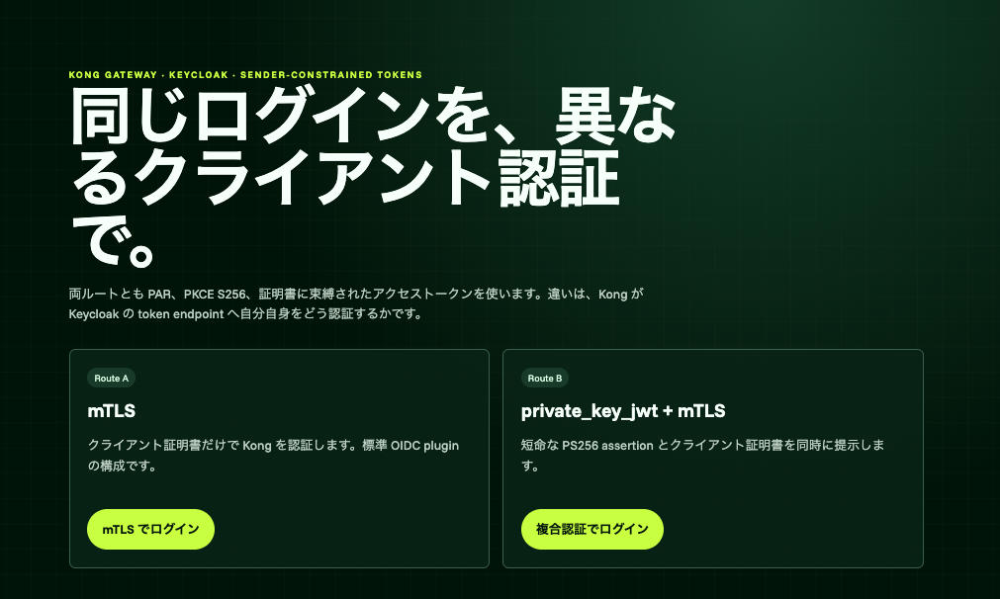
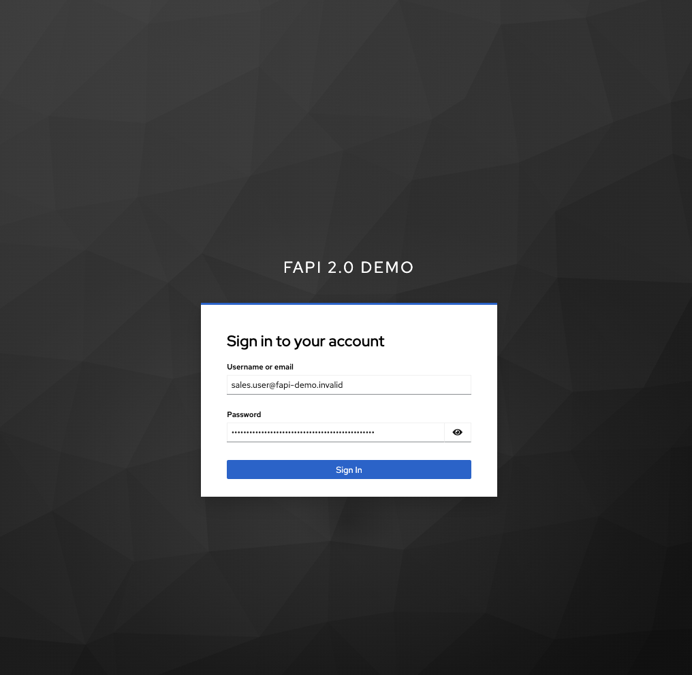

# Keycloak FAPI 2.0 クライアント認証デモ

Kong Gateway 3.16 を Konnect の data plane として動かし、同じ Keycloak realm に対する二つの OAuth クライアント認証方式を比較するローカルデモです。

| ルート | パス | token endpoint のクライアント認証 |
| --- | --- | --- |
| Route A | `/api/fapi/mtls` | `tls_client_auth` |
| Route B | `/api/fapi/pkj-mtls` | `private_key_jwt`（PS256）+ mTLS |

両ルートで PAR、PKCE S256、短命な認可コード、証明書に束縛されたアクセストークンを要求します。Upstream の PoP verifier は JWT の署名・issuer・audience・時刻・scope、`cnf.x5t#S256` と API Gateway が転送した3rd Partyのclient certificateとの一致を確認します。UpstreamへのTLS peerはAPI Gatewayとして別に検証します。

> このリポジトリは FAPI 2.0 の学習・比較用デモです。認定試験への適合を主張するものではありません。

## 現在の状態と範囲

WP1～WP6とEpic #6は承認範囲で受入済み・closedです。通常Route A/Bの認証、API応答、証明書binding、claim/header、偽装header拒否、logoutは確認済みです。WP6もUI表示、reset/switch、既存2 CPを使うclean checkout再現の受入確認を完了しました。検証層と未実行項目は[WP6受入表](docs/design/third-party-wp6-acceptance.md)、WP5のP0/P1/Dと承認済み未網羅範囲は[WP5受入表](docs/design/third-party-wp5-acceptance.md)を参照してください。

このデモは本番FAPI 2.0完全準拠、認定、production readinessを主張しません。Route BのPKJWT PARにおけるform `client_id`省略はRFC 9126の既知gapとして開示します。stock本文は変更しません。Keycloak 26.7.4のrevocation metadata URL差分は[ADR 0021](docs/decisions/0021-wp5-revocation-metadata-gap.md)のとおり既知差分として記録し、META-02完全一致とは扱いません。

Apple Siliconでは[ローカルCompose override](docker-compose.demo-native.yml)を使います。API Gatewayとverifierは公開amd64 imageを使い、third-party Data PlaneはKong Gateway 3.16.0.0のnative arm64 baseから起動して、このcheckoutのtransport/bridge sourceをread-onlyでmountします。overrideはimageをbuildせず、source treeだけを反映します。

開発依存を入れ、credential-freeの静的検証を行います。

```bash
python3 -m pip install --requirement requirements-dev.txt
make validate
make test
node tests/test_wp6_ui.js
```

## 構成

1. Terraform が Konnect control plane と data plane 証明書を管理します。
2. Keycloak はローカル HTTPS で起動し、生成済み realm を import します。
3. decK が二つの Route、OIDC plugin、upstream mTLS 証明書を Konnect へ登録します。
4. Route B のカスタム plugin が外部入力を拒否し、60 秒以内の PS256 client assertion を生成します。
5. PoP verifier が sender-constrained access token を検証し、トークンや証明書本体を含まない証跡だけを返します。
6. UI が認証方式、署名済み claim、Kong が設定した Upstream ヘッダー、証明書束縛の結果を表示します。

秘密鍵、パスワード、セッション secret、生成済み realm は `.generated/` に保存され、Git の対象外です。

## 前提条件

- Terraform 1.11 以降
- decK 1.53 以降
- `!reset`をサポートするDocker Compose（Compose 5.2.0で確認済み。[mergeの説明](https://docs.docker.com/reference/compose-file/merge/#reset-value)を参照）
- Python 3 と OpenSSL
- 既存2 Control Planeを読み取れるKonnect token
- Apple Siliconまたはarm64端末（third-party Data Planeはnative arm64で起動）
- Node.js（UI単体検査だけに使用。runtime依存ではありません）

Data plane は Konnect control plane から Enterprise ライセンスを取得します。ローカルの `KONG_LICENSE_DATA` は不要です。

## clean checkoutから既存デモを再現する

この手順は、受入済みの既存API/third-party Control PlaneとそのData Plane identityを再利用します。新しいControl Plane、Terraform apply、decK sync、Keycloak realm更新は行いません。新規Konnect環境のbootstrapにはTerraform、schema、foundation、runtimeの別previewと個別レビューが必要で、この再現手順の対象外です。

1. `.env.example`を`.env`へコピーし、利用するKonnect regionの`KONNECT_SERVER_URL`、`KONNECT_TOKEN`、`TF_VAR_control_plane_name`、`TF_VAR_third_party_control_plane_name`を既存のAPI/third-party環境に合わせます。
2. `.env`、`.generated`のruntime/PKI/realm/credentials、`infra/certs/`、既存Keycloak realmを再利用するなら`keycloak/data/`を、許可されたGit外backupから復元します。これらに含まれるtoken、password、secret、証明書と秘密鍵をcommitしません。
3. 既存2 Control Planeに対応するTerraform stateがある場合は`make render-runtime`でhostを再描画します。stateがない場合はbackupの`.generated/runtime.env`を使います。Control Planeが既に存在する環境へ、stateなしのTerraform workspaceから`make apply`を実行しません。
4. `make validate`、`make test`、`node tests/test_wp6_ui.js`を実行します。次にread-onlyのruntime diffを確認します。

```bash
GATEWAY=api STAGE=runtime make deck-diff
GATEWAY=third-party STAGE=runtime make deck-diff
```

既存環境では、APIの既知差分`openid-connect.config.cache_tokens_salt`の1 update（live値は非空、state未指定）とthird-party diff 0を期待します。strict migration guardはnon-zero diffを拒否するため、APIのread-only `make deck-diff`は既知の1行だけでもnon-zeroで終了する場合があります。guardを緩めず、Control Plane ownerへread-only diffの確認を依頼します。この既知行に対する追加syncは行いません。ほかの差分もsyncせず、対象と理由をownerに確認します。`plugin-schema-sync`、`deck-sync`、`make apply`をこの再現手順で実行しません。

5. Composeの対象とmerge結果をread-onlyで確認します。`COMPOSE_FILE`をexportするとreadiness supervisorも同じoverrideを使います。

```bash
export COMPOSE_FILE=docker-compose.yml:docker-compose.demo-native.yml
docker compose --env-file .env --env-file .generated/runtime.env --profile gateway --profile demo config --quiet
```

6. Dockerのimage取得・container起動は、対象imageとserviceをレビューして明示的に承認した後に行います。必要なpublic imageは先にpullし、起動時はbuild/pullを無効にします。third-party Data Planeのlistenerはこの承認済みdemo runにだけ明示して開きます。

```bash
docker compose --env-file .env --env-file .generated/runtime.env --profile gateway --profile demo pull keycloak ui pop-verifier kong-api kong-third-party
FAPI_DEMO_PROXY_LISTEN='0.0.0.0:8443 ssl' docker compose --env-file .env --env-file .generated/runtime.env --profile gateway up -d --no-build --pull never keycloak pop-verifier kong-api kong-third-party
scripts/require-wp5-readiness.sh --wait --timeout 120
FAPI_DEMO_PROXY_LISTEN='0.0.0.0:8443 ssl' scripts/require-wp5-readiness.sh --supervise
```

`--supervise`は全workerのreadinessを確認してからloopbackの8443入口を開き、UIを起動します。worker状態が変わると入口とUIを閉じます。ブラウザーでは <https://localhost:3443> を開き、Route A/Bを選択します。開発CAを信頼済みの端末でだけHTTPS result画面を確認してください。`https://localhost:8444`はKeycloak、`https://localhost:8443`はGateway入口です。

### Routeを切り替えてdemo userをresetする

同じbrowser profileを使い、Route Aでsales demo userとしてloginし、claim/headerを確認してからRoute Aのlogoutを選びます。Route Bへ進み、engineering demo userで新しくloginして同じ確認を行い、Route Bのlogoutを選びます。A→B→A→Bの順で繰り返し、毎回Keycloakのlogin formが表示されてから資格情報を入力します。結果画面ではRoute、azpから決まる認証方式、department、claim/header、binding、thumbprint先頭12文字を確認します。

logout後もKeycloakが既存SSO sessionを使ってlogin formを省く場合は、対象demo userだけをresetします。Keycloak Admin Consoleの`fapi-demo` realmで`Users`から対象ユーザーを開き、`Sessions`の`Logout all sessions`を実行してください。影響を受けるbrowserのlocalhost site cookieも消してから同じflowをやり直します。realm全体や別の利用者をresetしません。HTTPS警告を無視して先へ進まず、開発CAが信頼されていなければそのbrowser evidenceは未実行として記録します。

新しい隔離Keycloak環境を作る場合にだけ`make generate-dev-assets`を使い、空の`keycloak/data/`へrealmをimportします。既存DBを再利用する場合、生成し直したpassword/realmと混在させません。`make render-runtime`には対応するTerraform output stateが必要です。

[](https://picketfence-labs.github.io/diagrams/d4d6f772e970/)

*デモ開始画面。画像をクリックすると Route B のインタラクティブ workflow を開きます。*

[](https://picketfence-labs.github.io/diagrams/55b6534fdb5b/)

*Keycloak の認証画面。画像をクリックすると Route A のインタラクティブ workflow を開きます。*

## 確認ポイント

- Route A は `tls_client_auth` と表示される。
- Route B は `private_key_jwt` と表示される。
- `binding_verified` と署名再検証が成功する。
- UIのthumbprintは3rd Party→API Gateway間のtoken bindingとclient certificateを表し、それぞれ先頭12文字だけを表示する。
- デモユーザーに応じて `department` と `logical_route` が変わる。
- `department_header` と `logical_route_header` が署名済み claim と一致し、UI に「claim とヘッダー: 一致」と表示される。
- UI の偽装テストで送った `X-Demo-*` ヘッダーが、署名済み claim の値を上書きしない。
- Route A/Bのlogout後は同じcookie jarからfresh loginし、旧Route sessionを再利用できない。

## 現在の実装範囲

Route Aはstock OIDCの`tls_client_auth`を使います。Route Bはstock OIDCのPKJWTとmTLS transportへ既存bridge/custom transportを組み合わせます。API側はstock Resource Server設定と追加のPoP verifierを使い、認証済みclaimからUpstream headerを作ります。Kongが標準で行う処理とdemo固有の補完は[顧客向け説明](docs/design/third-party-demo-explainer.md)に分けて記載しています。

通常Route A/BのloginからAPI response、claim/header、binding、logoutと、A→B→A→Bのreset/switchは確認済みです。UIのresponse allowlistとazp mappingは単体検査済みです。HTTPS result画面はbrowserのCA信頼エラーにより未確認です。clean checkoutのnative compose overrideから5サービスを起動し、全worker readiness、UI/JSのHTTPS200・source一致、両Routeの代表フローを確認しました。確認後は通常作業ディレクトリから同じ構成でデモを再開しています。受入層ごとの状態は[WP6受入表](docs/design/third-party-wp6-acceptance.md)に記録しています。

## 停止と削除

ローカルコンテナーの停止も環境変更です。停止対象をレビューし、明示的な承認を得てから実行してください。`COMPOSE_FILE`をexportしたshellでは、以下の停止が同じnative overrideを使います。

```bash
make down
```

このデモの再現に`make destroy`は使いません。Terraformが管理するKonnectリソースの削除が必要な場合は、別途具体的な削除planをレビューして承認を得てください。

## セキュリティ上の注意

- `.env`、`.generated/`、`infra/certs/`、Terraform state を commit しないでください。
- Route B plugin はブラウザーから渡された `client_assertion` と `client_assertion_type` を拒否してから内部値を設定します。
- Kong は upstream へ転送する前に cookie と内部 client assertion ヘッダーを除去します。
- PoP verifier は raw token、Authorization ヘッダー、証明書本体を応答やアプリケーションログに出しません。
- 開発用 CA と鍵の有効期間・保管方法は本番用途を想定していません。

## 関連資料

- [設計概要](docs/design-brief.md)
- [Keycloak FAPI 2.0 デモ要件](docs/design/fapi2-keycloak-requirements.md)
- [設計資料と workflow](docs/design/README.md)
- [ADR 0006: custom plugin、GHCR、logout](docs/decisions/0006-fapi-custom-plugin-ghcr-logout.md)
- [ADR 0007: Keycloak-only FAPI 2.0 demo](docs/decisions/0007-keycloak-only-fapi2-demo.md)
- [ADR 0008: Route B endpoint認証の分担](docs/decisions/0008-route-b-endpoint-auth-split.md)
- [障害対応記録](docs/troubleshooting-log.md)
