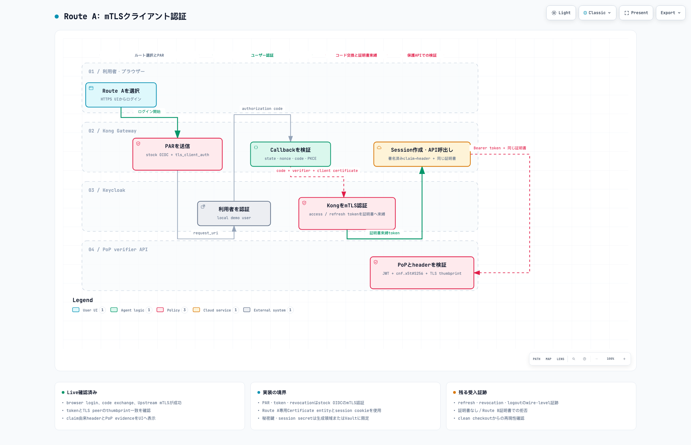
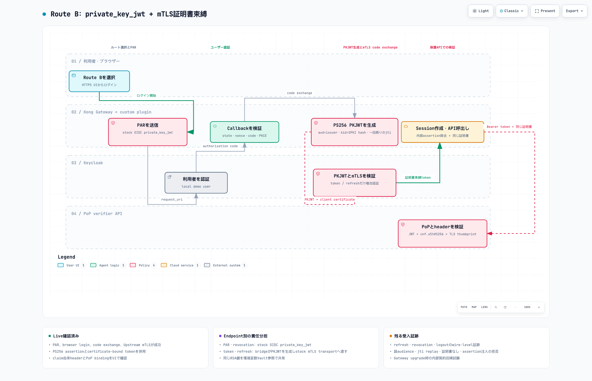
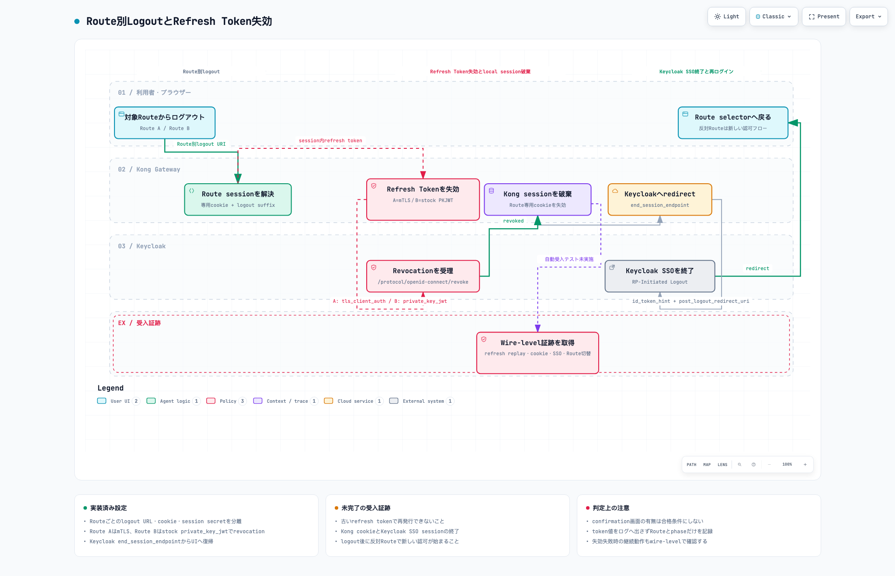

# Keycloak FAPI 2.0二経路デモ要件

## この文書の目的

この文書は、実装担当者が設計判断を再検討せずに開発を開始できるよう、FAPI 2.0二経路デモの要件、境界、受入条件を定義する。実装の正本はこの文書と[ADR 0007](../decisions/0007-keycloak-only-fapi2-demo.md)である。

要件キーワードは次の意味で使用する。

- **MUST**: 受入に必須
- **SHOULD**: 原則必須。逸脱する場合はPRで理由を記録
- **MAY**: 任意

## 目標

同じKong Gateway data planeから2つの独立したbrowser authorization code flowを実行し、token endpoint client authenticationだけを比較できるようにする。

| Route | Client authentication | Sender constraint |
|---|---|---|
| Route A | `tls_client_auth` | mTLS certificate-bound access token |
| Route B | `private_key_jwt` | mTLS certificate-bound access token |

両RouteはKeycloakでユーザーを認証し、PAR、PKCE S256、certificate-bound token、refresh、revocation、logoutを検証する。

## 対象読者

- Kong Gatewayとcustom pluginを実装する開発者
- Keycloak realmとclient policyを構成する開発者
- Terraform、decK、Docker Compose、GitHub Actionsを保守する開発者
- browser E2Eとsecurity negative testをレビューする担当者

## 完成時の利用者体験

1. 利用者はUIでRoute AまたはRoute Bを選択する。
2. KongはKeycloakへPARを送信する。
3. 利用者はKeycloakのlocal demo userでloginする。
4. Kongは選択したRouteのclient authenticationでauthorization codeを交換する。
5. KeycloakはKongのclient certificateへバインドしたaccess tokenとrefresh tokenを返す。
6. Kongは同じcertificateでPoP verifier APIを呼ぶ。
7. UIはclient authentication方式、token `cnf`、TLS certificate thumbprint、department、logical routeを表示する。
8. 利用者がlogoutすると、Kongはrefresh tokenをrevokeし、local sessionとKeycloak SSO sessionを終了する。
9. 利用者は反対側のRouteを新しいsessionで検証できる。

## Target architecture

### Runtime components

| Component | Responsibility |
|---|---|
| Kong Gateway 3.16.0.0 | OIDC RP、PAR、code exchange、session、header設定、upstream mTLS |
| `fapi-client-auth-bridge` custom plugin | Route BのPKJWT生成とmTLS transport併用、入力sanitization |
| Keycloak 26.7.4 | local login、FAPI policy、token発行、revocation、logout |
| PoP verifier API | JWT検証、`cnf`とTLS certificateのbinding検証、sanitized evidence返却 |
| Demo UI | Route選択、login結果、logout、negative testの開始 |
| Konnect control plane | Gateway configuration配布 |

### Container images

- Kong custom imageは`kong/kong-gateway:3.16.0.0`をbaseとすることMUST。
- Kong custom imageは`ghcr.io/picketfence-labs/konnect-oidc-fapi2-keycloak`へ発行することMUST。
- Keycloakは`quay.io/keycloak/keycloak:26.7.4`をdigestで固定することSHOULD。
- PoP verifierは最小構成のimageを使い、root権限なしで実行することSHOULD。
- Image tagは不変のGit commit tagを含むMUST。`latest`は存在してもMAYだが、受入環境では使用してはならない（MUST NOT）。

## Route and Serviceモデル

target Gateway configurationは、path選択された2つのRouteと2つのServiceを作成MUST。

| Route | Path | Service | Session cookie |
|---|---|---|---|
| Route A | `/api/fapi/mtls` | `fapi-mtls-service` | Route A専用のcookie名とsuffix |
| Route B | `/api/fapi/pkj-mtls` | `fapi-pkj-mtls-service` | Route B専用のcookie名とsuffix |

両Serviceは同じPoP verifier deploymentを対象にしてMAYだが、各Serviceは自分専用のKong Certificate entityを参照MUST。RouteはもうひとつのRouteのsession cookieを再利用してはならない（MUST NOT）。

既存の`department`挙動は引き続き対象範囲とする。

- Keycloakはnamespaced `department`とrouteのclaimを発行MUST。
- Kongは受信した`X-Demo-Department`と`X-Demo-Route`を署名済みclaimで上書きMUST。
- Header偽装は選択済みlogical Upstreamを変更してはならない（MUST NOT）。
- `Authorization`、`Cookie`、内部PKJWT transport header、private key materialはecho responseやapplication logへ到達してはならない（MUST NOT）。

## Keycloak requirements

### Realm

実装は専用realmを用意MUST（推奨名`fapi-demo`）。Realm設定は宣言的でレビュー可能であることMUST。Dashboardだけの手動設定は受入条件を満たさない。

Realmは次を提供MUST。

- OIDC discovery
- PAR endpoint
- authorization endpoint
- token endpoint
- revocation endpoint
- end-session endpoint
- JWKS endpoint
- 信頼済みdevelopment CAによるHTTPS

### Demo userとclaim

生成済みpasswordを持つuserを2名以上用意する。

| User role | `department` | `route` |
|---|---|---|
| Sales demo user | `sales` | `sales-route` |
| Engineering demo user | `engineering` | `engineering-route` |

PasswordはGit外で生成し、明示的なoperator commandだけで取得可能にすることMUST。Protocol Mapperは、namespaced claimをID tokenとaccess tokenへ追加MUST。

### FAPI policy

両clientはKeycloakの`fapi-2-security-profile` client policy、または同等の制御を明示した独自policyを使用MUST。

Policyは次を強制MUST。

- authorization code flow
- 全authorization requestへのPAR
- PKCE（`S256`）
- confidential clientのclient authentication
- 60秒以下のauthorization code lifetime
- 署名済みID token
- FAPI互換の署名algorithm
- sender-constrained access token
- refresh tokenのサポート

本デモはFAPI 2.0 Security Profileを対象とする。FAPI 2.0 Message Signingと認定審査への提出は対象外。

### Route A client

推奨client ID: `kong-fapi-mtls`。

Clientは次をMUST。

- `tls_client_auth`、またはKeycloak標準相当のX.509 client authenticatorで認証する
- Route Aのclient certificateまたはその発行CAだけを信頼する
- mTLS certificate-boundのaccess tokenとrefresh tokenを発行する
- 登録済みcertificateがないtoken requestを拒否する
- Route Bのcertificateを使ったtoken requestを拒否する

### Route B client

推奨client ID: `kong-fapi-pkj-mtls`。

Clientは次をMUST。

- `private_key_jwt`で認証する
- KongのRoute B private JWKに対応する公開鍵だけを登録する
- FAPI互換のclient assertion algorithmを要求する（推奨`PS256`）
- `aud`がKeycloak issuer文字列と一致することを要求する
- 期限切れのassertionと再送された`jti`を拒否する
- Route BのTLS certificateを使ったmTLS certificate-boundのaccess tokenとrefresh tokenを発行する
- 有効なPKJWTを含むがTLS client certificateを省略したtoken requestを拒否する

### Key material

実装は次の用途ごとに別々の鍵材料を使用MUST。

- Keycloak server TLS
- Route Aのclient authenticationとtoken binding
- Route Bのtoken binding
- Route BのPKJWT signing
- PoP verifier server TLS

Private keyはGit、Terraform state output、decK state、browser response、logへ入ってはならない（MUST NOT）。生成物がignore対象であれば、development certificateはリポジトリローカルのCA workflowから発行してもよい（MAY）。

## Kong Gateway requirements

### Route A OpenID Connect configuration

Route Aは、custom token request codeを持たないstock OpenID Connect pluginを使用SHOULD。

Configurationは次をMUST。

- Keycloak discoveryを使う
- PARを使う
- PKCE S256を使う
- token endpoint client authenticationを`tls_client_auth`に設定する
- Route A Certificate entityを参照する
- Keycloakがmtls endpoint aliasを公開している場合はそれを使う
- session authenticationを有効化する
- Route A専用のredirect URI、logout suffix、session secretを使う

### Route B custom plugin contract

custom pluginは、小さなpreprocessorのままであることMUST。新しいbrowser session、authorization endpoint、BFFを実装してはならない（MUST NOT）。

tokenとrefresh requestについて、pluginは次をMUST。

1. query、body、headerからclient供給の`client_assertion`と`client_assertion_type`を拒否または除去する。
2. `iss = sub = client_id`とする新しいPrivate Key JWTを生成する。
3. `aud`をKeycloak issuer文字列と正確に一致させる。
4. 暗号学的にランダムで一回限りの`jti`を生成する。
5. lifetimeを60秒以下に設定する。
6. 設定済みのFAPI互換private JWKで署名する。
7. assertionをupstream applicationへ露出せずOpenID Connect pluginへ渡す。
8. stock OIDCのmTLS certificate loadingとendpoint transport pathを再利用する。
9. protected Service requestの前に内部transport headerを除去する。

pluginはOpenID Connect pluginより前に実行することMUST。cleanup pluginは認証後かつapplicationへのproxy前に実行することMUST。

pluginは次の場合にfail closedすることMUST。

- issuerが欠落しているか、discoveryと異なる
- private JWKが利用できない
- TLS certificateが利用できない
- assertion生成が失敗する
- 外部requestがassertion parameterを供給しようとする

pluginは、pinされたGateway image内の`kong.openid-connect.utils`を再利用してもよい（MAY）。これは内部moduleであるため、Gateway upgrade時にsignatureや挙動のdriftを検出するテストを用意することMUST。

### Outbound Service mTLS

各Serviceは、そのRouteのbound tokenを取得した際と同じcertificateを提示することMUST。共有によってRoute別のclient certificateが使えなくなる場合、実装はService entityを共有してはならない（MUST NOT）。

## PoP verifier API contract

PoP verifierはセキュリティ境界の一部である。次をMUST。

1. 検証済みTLS client certificateを要求する。
2. JWT署名をKeycloak JWKSに対して検証する。
3. `iss`、`aud`、`exp`、`nbf`、必須scopeを検証する。
4. `cnf.x5t#S256`を要求する。
5. TLS peer certificateのSHA-256 thumbprintを計算する。
6. 両thumbprintをconstant-time比較する。
7. claimが欠落または不一致の場合は`401 invalid_token`を返す。
8. UIへはsanitized evidenceだけを返す。

Responseは次を含んでもよい（MAY）。

- Route識別子
- client authenticationのlabel
- token certificate thumbprint
- TLS peer certificate thumbprint
- `department`とlogical `route`
- binding結果のboolean

Responseは、raw token、cookie、private key、完全なcertificate、client assertionを含んではならない（MUST NOT）。

## Logout and revocation contract

各Routeは、それぞれ別のlogout URLを公開することMUST。

Logout sequenceは次であることMUST。

1. Route固有のKong sessionを解決する。
2. Routeのclient authentication方式でKeycloakへrefresh tokenをrevokeする。
3. Kong sessionを破棄し、Route固有のcookieを失効させる。
4. browserをKeycloakの`end_session_endpoint`へredirectする。
5. browserをroute selector UIへ戻す。

Revocationが失敗した場合でも、Kongはlocal logoutとKeycloak logoutを継続SHOULD。これは利用者がsessionへ閉じ込められないようにするため。実装は、token値を含めずに失敗をログへ記録することMUST、かつ自動化されたlogout受入scenarioを失敗させることMUST。

specificなconfirmation画面の表示は受入条件ではない。有効な`id_token_hint`があれば、Keycloakはconfirmationを省略してただちにsessionを終了・redirectしてもよい。

## UI requirements

UIは次を提供MUST。

- Route Aのloginボタン
- Route Bのloginボタン
- 現在のRoute用のlogoutボタン
- 有効なclient authentication方式
- `department`とlogical route
- token certificate thumbprint
- TLS peer certificate thumbprint
- binding検証結果
- 想定されるnegative testに対する明確なerror表示

UIは、access token、refresh token、client assertion、private keyをbrowser storageへ保存してはならない（MUST NOT）。

## Delivery and automation requirements

### Infrastructure as code

- Keycloak realm、client、role、user、Protocol Mapper、client policyは宣言的であることMUST。
- Gateway entityはdecK stateに残すことMUST。
- Konnect infrastructureはTerraformに残してもよい（MAY）。
- Auth0 resourceは、対象dependency graphから削除するか、optionalなlegacy profileの背後へ分離することMUST。
- `make validate`は安全であり続け、live systemを変更してはならない（MUST NOT）。
- Apply、sync、image push、destroyは明示的なcommandであり続けることMUST。

### GHCR

Repositoryは、次を行うGitHub Actions workflowを追加することMUST。

1. custom Kong imageをbuildする。
2. unit、integration、static testを実行する。
3. SBOMを生成する。
4. 文書化されたseverity policyでvulnerability scanを実行する。
5. testが成功した後だけ発行する。
6. GHCRに対して`packages: write`を使う。
7. 不変のcommit tagを発行し、image digestを記録する。

Workflowは、secretやprivate key materialを出力してはならない（MUST NOT）。

## Observability and evidence

実装は、credentialを露出せずに2つのRouteを区別できるevidenceを生成することMUST。

必須のevidence:

- PARがbrowser authorizationより前に行われる。
- Route Aのtoken requestがRoute Aのcertificateを提示し、PKJWTを伴わない。
- Route Bのtoken requestがRoute Bのcertificateと有効なPKJWTを提示する。
- Keycloak tokenが`cnf.x5t#S256`を含む。
- Protected APIがtoken bindingに使われた同じcertificateを受け取る。
- Negative requestが想定された境界で失敗する。
- Logoutがrefresh tokenをrevokeし、KongとKeycloakの両sessionを終了させる。

Logは、RouteとPhaseを識別できることMUST。Logは、token値、cookie、assertion、JWK、certificate private key、authorization codeをredactすることMUST。

## Acceptance scenarios

### Positive scenarios

| ID | Scenario | Pass condition |
|---|---|---|
| A-PAR-01 | Route A browser login | PAR、PKCE S256、mTLS client authenticationが完了する |
| A-POP-01 | Route A protected API call | `cnf`がRoute A TLS peer certificateのthumbprintと一致する |
| B-PAR-01 | Route B browser login | PARとPKCE S256が完了する |
| B-PKJ-01 | Route B code exchange | KeycloakがissuerをaudienceとするPS256 PKJWTと一回限りの`jti`を受理する |
| B-POP-01 | Route B protected API call | `cnf`がRoute B TLS peer certificateのthumbprintと一致する |
| CLAIM-01 | Sales・engineeringのlogin | 署名済みclaimが期待するlogical Upstreamへ導く |
| LOGOUT-A-01 | Route A logout | refresh replayが失敗し、cookieが失効し、Keycloak sessionが終了する |
| LOGOUT-B-01 | Route B logout | refresh replayが失敗し、cookieが失効し、Keycloak sessionが終了する |
| SWITCH-01 | logout後のRoute切替 | 反対側のRouteが新しいauthorization flowを開始する |

### Negative scenarios

| ID | Scenario | Expected result |
|---|---|---|
| A-CERT-01 | certificateなしのRoute A token request | Keycloakがclient authenticationを拒否する |
| A-CERT-02 | Route B certificateを使ったRoute A token request | Keycloakがclient authenticationを拒否する |
| B-AUD-01 | `aud`をtoken endpoint URLにしたRoute B PKJWT | Keycloakがassertionを拒否する |
| B-JTI-01 | Route B assertionの再送 | Keycloakが再送を拒否する |
| B-SPOOF-01 | Browserが`client_assertion`を供給する | custom pluginが入力を拒否または除去する |
| B-CERT-01 | TLS certificateなしの有効なPKJWT | Keycloakがtoken発行を拒否する |
| POP-01 | client certificateなしのbound token | PoP verifierが`401 invalid_token`を返す |
| POP-02 | もう一方のRouteのcertificateを使ったbound token | PoP verifierが`401 invalid_token`を返す |
| HEADER-01 | Browserがdepartmentとrouteのheaderを偽装する | 署名済みclaimが両方の値を上書きする |
| LEAK-01 | Application responseとlogの点検 | token、cookie、assertion、private keyが存在しない |

## Definition of done

開発は次のとき完了とする。

- すべてのpositiveとnegative scenarioが自動化で通過するか、文書化されたbrowser evidence手順を持つ
- clean checkoutから`make validate`が通る
- syncの前は意図したtag付きentityだけが`deck diff`に現れ、sync後はdiffが無い
- custom imageが不変のtagとdigestでGHCRから取得できる
- 新しい環境が、文書化されたcommandからsecret生成、Keycloak起動、data plane接続、両Routeの実行までを行える
- logoutとRoute切替が両Routeで成功する
- documentationがOpenID Foundation certificationを主張していない

## Out of scope

- production HAとdisaster recovery
- production PKIまたはHSM連携
- Entra ID federation、MFA、Conditional Access
- Auth0 HRI
- FAPI 2.0 Message Signing
- OpenID Foundation certificationへの提出
- production audit retention
- 実顧客のIDやデータ

## Delivery sequence

1. 生成済みdevelopment PKIとともにKeycloakとPoP verifierのscaffoldingを追加する。
2. Route Aを実装し、mTLS-bound tokenの発行を実証する。
3. Route B custom pluginとunit testを実装する。
4. Route BのPKJWTとmTLS token bindingを実証する。
5. 両Routeへrevocationとlogoutを追加する。
6. UI evidenceとnegative testを追加する。
7. GHCR build、SBOM、scan、不変tagでのpublishを追加する。
8. 実装evidenceがworkflowと一致した時点でだけdiagramを更新する。

## Workflow diagrams

各diagramは、レビュー用のJSON source、静的なPNG、インタラクティブなHTML artifactの3形態で管理する。JSON/PNG/HTMLはこのrepository内の`workflows/`に残し、インタラクティブなHTML artifactは共有用にGitHub Pagesへも公開している。

*Route A: mTLSクライアント認証。画像をクリックするとインタラクティブ版を開く。* Source: [JSON](workflows/route-a-mtls.workflow.json) / [ローカルHTML](workflows/route-a-mtls.workflow.html)

*Route B: private_key_jwt + mTLS証明書束縛。画像をクリックするとインタラクティブ版を開く。* Source: [JSON](workflows/route-b-pkj-mtls.workflow.json) / [ローカルHTML](workflows/route-b-pkj-mtls.workflow.html)

*Route別LogoutとRefresh Token失効。画像をクリックするとインタラクティブ版を開く。* Source: [JSON](workflows/logout.workflow.json) / [ローカルHTML](workflows/logout.workflow.html)

diagramはworkflowを説明するものであり、実装状況そのものではない。受入判定は本文書のtestに従う。

## Primary sources

- [FAPI 2.0 Security Profile](https://openid.net/specs/fapi-security-profile-2_0.html)
- [OAuth 2.0 Mutual-TLS Client Authentication and Certificate-Bound Access Tokens](https://www.rfc-editor.org/rfc/rfc8705)
- [Keycloak FAPI support](https://www.keycloak.org/securing-apps/oidc-layers#_fapi-support)
- [Keycloak Server Administration Guide](https://www.keycloak.org/docs/latest/server_admin/)
- [Kong OpenID Connect plugin](https://developer.konghq.com/plugins/openid-connect/)
