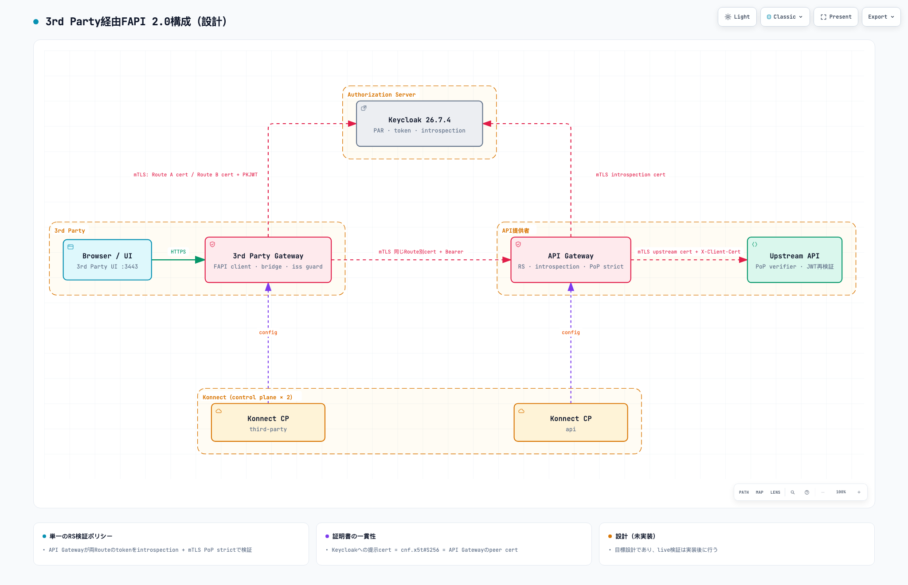
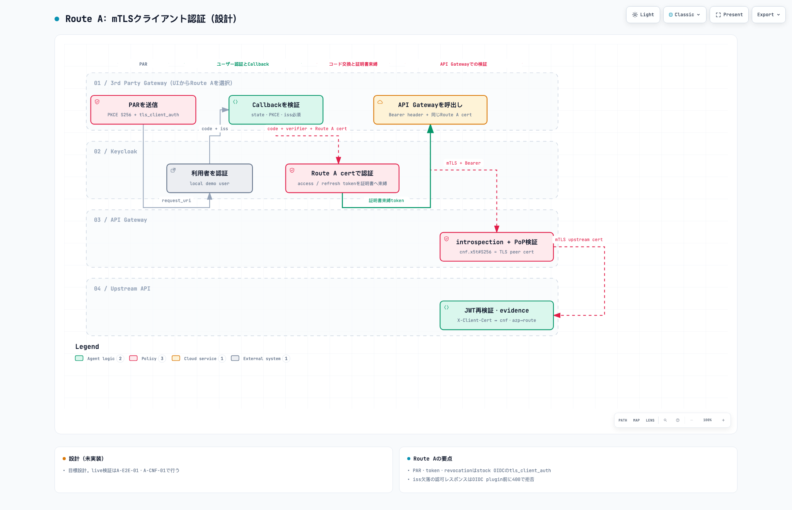
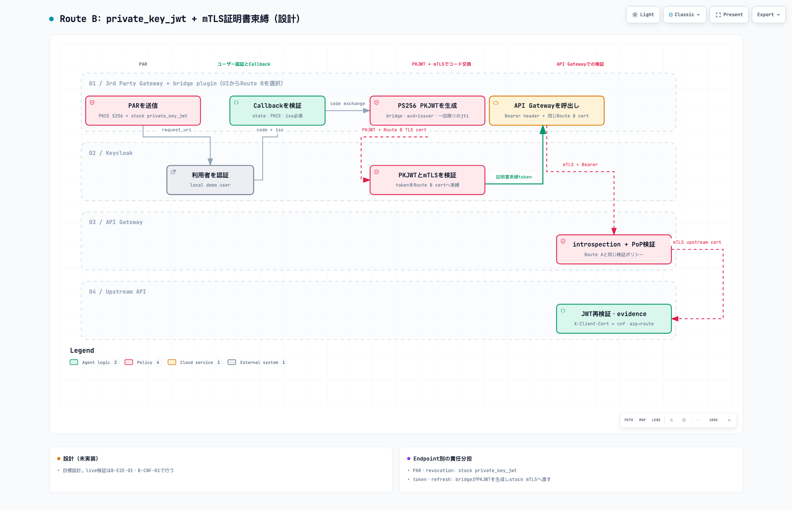
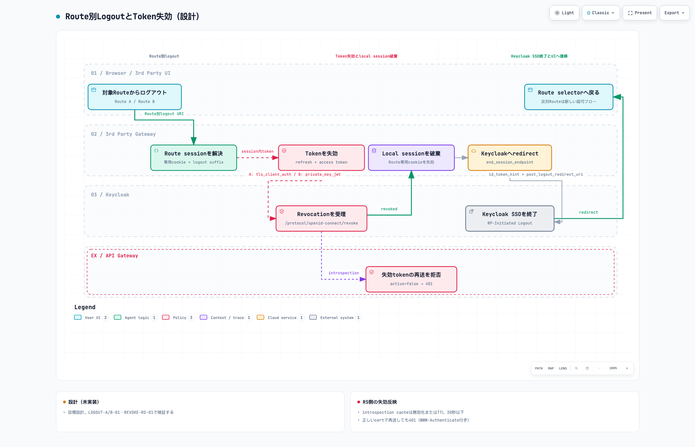

# 3rd Party経由FAPI 2.0デモ要件

## この文書の目的

この文書は、既存の二経路デモ（[Keycloak FAPI 2.0二経路デモ要件](fapi2-keycloak-requirements.md)、以下「v1要件」）に3rd Partyを追加した構成について、実装契約を定義する。実装担当者が設計判断を再検討せずに開発を始められるようにする。

- 設計判断の正本: [ADR 0009](../decisions/0009-third-party-client-gateway-topology.md)、[ADR 0010](../decisions/0010-api-gateway-resource-server-validation.md)
- FAPI 2.0必須要件の正本: [3rd PartyとAPI GatewayのFAPI 2.0必須要件](third-party-fapi2-conformance.md)
- 作業分割と検証方法: [Delivery plan](third-party-delivery-plan.md)

要件キーワード（MUST、SHOULD、MAY）は、v1要件と同じ意味で使う。この文書に記載のない事項は、v1要件を継続して適用する。v1要件と矛盾する場合は、この文書を優先する。

## 変更の要約

| 観点 | v1（現行main） | 本要件 |
|---|---|---|
| FAPI client（RP） | Kong Gateway | **3rd Party**。実装例として**3rd Party Gateway**（新設のKong） |
| Resource Server | PoP verifier API | **API Gateway**（既存のKong）。PoP verifierは**Upstream API**として残す |
| 利用者の経路 | UI → Kong → PoP verifier | UI → 3rd Party Gateway → API Gateway → Upstream API |
| Konnect control plane | 1つ | **2つ**（API用と3rd Party用。組織境界を表す） |
| client認証の方式 | Route A / Route B | 変更なし。両Routeとも3rd Party Gatewayへ移る |
| sender constraint | mTLS | 変更なし。mTLSで統一する |

既存の直接経路（UIからKongへのRoute A/B）は残さず、3rd Party経由の経路で置き換える。

## 目標

1. 3rd PartyがKeycloakとの認可コードフローでsender-constrained access tokenを取得し、API Gateway経由でUpstream APIを呼べること。
2. 3rd Partyのclient認証を、Route A（`tls_client_auth`）とRoute B（`private_key_jwt`）の2方式で比較できること。
3. API Gatewayが、client認証方式に依存しない**単一の検証ポリシー**で両Routeのtokenを検証すること。
4. 3rd Party側のFAPI 2.0必須要件を、実装に依存しない形で明確にすること。そのうえで、Kongによる実装例の充足状況とgapを示すこと。

## 完成時の利用者体験

1. 利用者は3rd PartyのUIでRoute AまたはRoute Bを選ぶ。
2. 3rd Party GatewayがKeycloakへPARを送る。
3. 利用者はKeycloakのlocal demo userでloginする。
4. 3rd Party Gatewayは、選んだRouteのclient認証でauthorization codeを交換する。
5. Keycloakは、3rd Party GatewayのRoute別client certificateに束縛したaccess tokenとrefresh tokenを返す。
6. 3rd Party Gatewayは、同じcertificateでAPI GatewayへmTLS接続し、Bearer tokenを送る。
7. API Gatewayはintrospectionとcertificate bindingを検証し、claim由来のheaderを設定して、Upstream APIへ転送する。
8. UIは次を表示する: client認証方式、token `cnf`、API Gatewayが受け取ったTLS peer certificateのthumbprint、`azp`、`department`、logical route。
9. logoutでは、3rd Party Gatewayがrefresh tokenとaccess tokenをrevokeし、local sessionとKeycloak SSO sessionを終了する。revoke済みのaccess tokenは、API Gatewayで拒否される。

## Target architecture

### Runtime components

| Component | 組織 | Responsibility |
|---|---|---|
| Demo UI | 3rd Party | Route選択、結果表示、logout、negative testの起動 |
| 3rd Party Gateway（Kong 3.16.0.0） | 3rd Party | FAPI client: PAR、PKCE、client認証、code exchange、session、refresh、revocation、logout。API GatewayへのmTLS接続 |
| `fapi-client-auth-bridge` custom plugin | 3rd Party | Route BのPKJWT生成とmTLS transportの併用（v1から移設、契約は変えない） |
| Keycloak 26.7.4 | Authorization Server | local login、FAPI policy、token発行、introspection、revocation、logout |
| API Gateway（Kong 3.16.0.0） | API提供者 | Resource Server: client certificateの要求、introspection、certificate bindingの検証、claim由来headerの設定、Upstreamへの転送 |
| Upstream API（PoP verifier） | API提供者 | API GatewayからのmTLS接続だけを受け付ける。JWT署名を再検証し、転送されたclient certificateと`cnf`を照合する多層防御。sanitizedなevidenceを返す |
| Konnect control plane × 2 | — | API Gateway用と3rd Party Gateway用に、構成を別々に配布する |

### 接続とcertificate

| 区間 | TLS | 提示するclient certificate | 信頼の根拠 |
|---|---|---|---|
| Browser → UI、Browser → 3rd Party Gateway | HTTPS | なし | 開発CA |
| 3rd Party Gateway → Keycloak（PAR、token、revoke） | mTLS | Route A cert、またはRoute B TLS cert | Keycloak clientへの登録 |
| 3rd Party Gateway → API Gateway | mTLS | **tokenの取得時と同じ**Route別cert | `cnf.x5t#S256`との一致 |
| API Gateway → Keycloak（introspection） | mTLS | API Gateway introspection cert | Keycloak clientへの登録 |
| API Gateway → Upstream API | mTLS | API Gateway upstream cert | Upstream APIが信頼するcertの固定 |

v1要件の「Key material」は継続し、次の鍵材料を追加する。用途ごとに別々の鍵材料を使うこと（MUST）。

- API Gateway server TLS
- API Gateway introspection client authentication
- API Gateway → Upstream APIのclient certificate

3rd Party Gateway server TLS（browser向け）は、v1のKong proxy certificateを引き継いでよい（MAY）。

### Network and ports

| Service（compose） | Host port | 用途 |
|---|---|---|
| `ui` | 3443 | 3rd PartyのUI |
| `kong-third-party` | 8443 | 3rd Party Gateway。browserからのredirect先 |
| `kong-api` | 9443 | API Gateway。compose network内では`kong-api:8443`。host portはnegative testの直接requestにだけ使う |
| `keycloak` | 8444 | Authorization Server |
| `pop-verifier` | 公開しない | Upstream API |

3rd Party Gatewayのbrowser向けportを8443に据え置くことで、redirect URIのhostとportをv1から変えずに済む。

### Container images

v1要件の「Container images」を継続する。両Gatewayは同じcustom image（`ghcr.io/picketfence-labs/konnect-oidc-fapi2-keycloak`）を使ってよい（MAY）。API Gatewayでは`fapi-client-auth-bridge`を有効化しない（MUST NOT）。`KONG_PLUGINS`は、Gatewayごとに必要最小限にする（SHOULD）。

## Keycloak requirements

v1要件の「Realm」「Demo userとclaim」「FAPI policy」を継続する。clientは次のとおり置き換える。

| Client ID | 役割 | client認証 | 備考 |
|---|---|---|---|
| `third-party-fapi-mtls` | 3rd Party Route A | `tls_client_auth` | v1 `kong-fapi-mtls`を置換 |
| `third-party-fapi-pkj-mtls` | 3rd Party Route B | `private_key_jwt`（token/refreshは同時にmTLS） | v1 `kong-fapi-pkj-mtls`を置換 |
| `api-gateway-introspection` | API GatewayのResource Server | `tls_client_auth` | introspection専用。authorization code flowを許可しない |

- 3rd Party clientのredirect URIは、`https://localhost:8443/api/fapi/mtls`と`https://localhost:8443/api/fapi/pkj-mtls`とすること（MUST）。
- access tokenの`aud`は`fapi-demo-api`を含むこと（MUST）。v1のaudience `pop-verifier`は、`fapi-demo-api`へ置き換える。
- access tokenは`azp`（3rd Party clientのclient ID）を含むこと（MUST）。Upstream APIは、Route識別にheaderではなく`azp`を使う。
- `api-gateway-introspection`のintrospection応答は、`active`、`cnf.x5t#S256`、`aud`、`scope`、namespaced claimを含むこと（MUST）。含まない項目がある場合は、ADR 0010の代替案で扱う。
- refresh token rotationの検証用に、3rd Party clientでrefresh tokenの再発行（Keycloakの「Revoke Refresh Token」相当）を切り替えられること（SHOULD）。既定は無効とする（FAPI 2.0 §5.3.2.1）。

## 3rd Party Gateway requirements

v1要件の「Route A OpenID Connect configuration」「Route B custom plugin contract」「Logout and revocation contract」は、実行場所を3rd Party Gatewayへ移したうえで継続する。

- Route Aのpathは`/api/fapi/mtls`、Route Bのpathは`/api/fapi/pkj-mtls`とすること（MUST）。
- 各RouteのServiceは、`https://kong-api:8443/fapi-api/evidence`を対象にすること（MUST）。`client_certificate`には、そのRouteのtoken取得に使ったものと同じCertificate entityを指定すること（MUST）。
- API Gatewayのserver certificateを、開発CAで検証すること（MUST、`tls_verify: true`）。
- access tokenは`Authorization: Bearer`でだけ送ること（MUST）。
- `iss`を含まない認可レスポンスを、OpenID Connect pluginより前に拒否すること（MUST、conformance C-15）。stockの`pre-function`を第一候補とする。使えない場合はcustom pluginで実装し、理由をPRに記録する。
- refresh responseに新しいrefresh tokenがある場合は、それをsessionへ保存すること（MUST、conformance C-09）。
- 3rd Party Gatewayの静的endpoint設定（authorization、token、PAR、revocation、end-session、JWKS、mTLS alias）は、discoveryの値と一致すること（MUST）。一致はテストで確認する。
- client供給の`client_assertion`、`client_assertion_type`、`X-Client-Cert*`、`X-Demo-*`、`X-Fapi-*`は、API Gatewayへの転送前に除去すること（MUST）。

## API Gateway requirements

API Gatewayは1つのServiceと1つのRoute（path `/fapi-api/evidence`）で、両Routeのtokenを同じポリシーで検証すること（MUST）。

| 項目 | 要件 |
|---|---|
| client certificate | `tls-handshake-modifier`でclient certificateを要求する（MUST）。compose network内（SNI `kong-api`）とhost（SNI `localhost`）の両方から要求されることを確認する |
| token取得 | `bearer_token_param_type: [header]`（MUST）。queryやbodyのtokenは受け付けない |
| token検証 | `auth_methods: [introspection]`、`introspection_endpoint_auth_method: tls_client_auth`、`introspection_check_active: true`（MUST） |
| 失効の反映 | introspectionのcacheは無効化するか、TTLを30秒以下にする（MUST） |
| 認可範囲 | `issuers_allowed`はKeycloak issuer、`audience_required`は`fapi-demo-api`、`scopes_required`は`openid`（MUST） |
| sender constraint | `proof_of_possession_mtls: strict`（MUST） |
| claim由来header | `X-Demo-Department`と`X-Demo-Route`を検証済みclaimから設定し、client供給の値を上書きする（MUST） |
| certificateの転送 | `tls-metadata-headers`で`inject_client_cert_details: true`とし、URLエンコードしたPEMをUpstreamへ転送する（MUST） |
| 資格情報の除去 | `Cookie`と、client供給の`X-Fapi-*`をUpstreamへ送らない（MUST）。`Authorization`はUpstreamの再検証のために転送してよい（MAY） |
| Upstreamへの接続 | API Gateway upstream certでmTLS接続し、Upstream APIのserver certificateを検証する（MUST） |
| TLS | TLS 1.2以上、BCP195推奨のcipher suite（MUST） |
| error | `401`、`403`で`WWW-Authenticate`を返す（MUST） |

`tls-handshake-modifier`、`tls-metadata-headers`、`proof_of_possession_mtls`の挙動は`kong-ee` masterのsourceで確認した。3.16.0.0のschemaで同じ挙動であることを、実装時に確認すること（MUST）。

## Upstream API contract

v1の「PoP verifier API contract」を次のように変更する。

1. TLS client certificateが**API Gateway upstream cert**であることを要求する（MUST）。それ以外の接続は拒否する。
2. JWT署名をKeycloak JWKSで検証し、`iss`、`aud=fapi-demo-api`、`exp`、`nbf`、必須scopeを検証する（MUST）。algorithmはPS256だけを許可する。
3. `cnf.x5t#S256`を要求する（MUST）。
4. API Gatewayが転送した`X-Client-Cert`をURLデコードし、そのSHA-256 thumbprintを`cnf.x5t#S256`とconstant-time比較する（MUST）。
5. 不一致または欠落の場合は`401 invalid_token`を返す（MUST）。
6. Route識別子は`azp`から導出する（MUST）。`X-Fapi-Route`などのheaderからは導出しない。

responseは、v1に次を加えてよい（MAY）: `azp`、API Gatewayが検証したTLS peer certificateのthumbprint、Upstream自身による再検証結果のboolean。

## UI requirements

v1の「UI requirements」を継続する。表示する「TLS peer certificate thumbprint」は、**API Gatewayが受け取った3rd Party Gatewayのcertificate**のthumbprintとする。UIは、構成図上でどの区間の証跡かを示すラベルを表示すること（SHOULD）。

## Delivery and automation requirements

v1の「Infrastructure as code」「GHCR」を継続し、次を追加する。

- Terraformは、API Gateway用と3rd Party Gateway用の2つのKonnect control planeと、それぞれのdata plane certificateを管理すること（MUST）。既存のcontrol planeは、API Gateway用として再利用する（SHOULD）。
- decK stateは、Gatewayごとに別ファイルとすること（MUST、例: `kong/api-gateway.yaml`、`kong/third-party-gateway.yaml`）。`make deck-diff`と`make deck-sync`は、対象Gatewayを明示して実行できること（MUST）。
- `make validate`は、両方のdecK stateを検証すること（MUST）。live systemは変更しないこと（MUST NOT）。
- GitHub Actionsで`make validate`と`make test`をPRのstatus checkとして実行すること（SHOULD）。

## Observability and evidence

v1の必須evidenceを継続し、次を追加する。

- 3rd Party GatewayがAPI Gatewayへ提示したcertificateのthumbprintが、Keycloakでtoken取得時に提示したcertificateのthumbprint、およびtokenの`cnf.x5t#S256`と一致する。
- API Gatewayのintrospection requestが、API Gateway introspection certで認証されている。
- revoke済みのaccess tokenが、API Gatewayで`401`になる。
- 3rd Party GatewayからAPI Gatewayへのrequestが、Authorization headerだけでtokenを運んでいる。

## Acceptance scenarios

v1のシナリオIDは、実行主体を3rd Party Gatewayへ読み替えて継続する（`A-PAR-01`、`B-PAR-01`、`B-PKJ-01`、`CLAIM-01`、`LOGOUT-A-01`、`LOGOUT-B-01`、`SWITCH-01`、`A-CERT-01`、`A-CERT-02`、`B-AUD-01`、`B-JTI-01`、`B-SPOOF-01`、`B-CERT-01`、`HEADER-01`、`LEAK-01`）。v1の`A-POP-01`、`B-POP-01`、`POP-01`、`POP-02`は、次の表のシナリオで置き換える。

### Positive scenarios

| ID | Scenario | Pass condition |
|---|---|---|
| A-E2E-01 | Route Aで、loginからUpstream API呼び出しまで | UIに、`azp=third-party-fapi-mtls`とbinding一致が表示される |
| B-E2E-01 | Route Bで、loginからUpstream API呼び出しまで | UIに、`azp=third-party-fapi-pkj-mtls`とbinding一致が表示される |
| A-CNF-01 | Route Aのcertificate一貫性 | Keycloakでの提示cert、`cnf.x5t#S256`、API Gatewayでのpeer certのthumbprintが一致する |
| B-CNF-01 | Route Bのcertificate一貫性 | 同上（Route B TLS cert） |
| PAR-01 | PARの強制 | authorization requestより前にPARが行われる |
| PAR-02 | authorization endpointへのparameter | redirect URLのqueryが`client_id`と`request_uri`だけ。`nonce`は64文字以下 |
| PKCE-01 | PKCE | PAR bodyに`code_challenge_method=S256`があり、challengeがrequestごとに異なる |
| META-01 | issuerの一致 | 設定したissuerと、discoveryの`issuer`が一致する |
| META-02 | endpointの一致 | 3rd Party Gatewayの静的endpoint設定と、discoveryの値（`mtls_endpoint_aliases`を含む）が一致する |
| RT-01 | refresh | access tokenの期限切れ後に、同じcertificateでrefreshが成功する |
| RT-ROT-01 | refresh token rotation | Keycloakでrotationを有効にしたとき、新しいrefresh tokenで次のrefreshが成功する |
| RS-VALID-01 | introspection | API Gatewayが、API Gateway introspection certでintrospectionを行う |
| HDR-01 | tokenの送信方法 | 3rd Party GatewayからAPI Gatewayへのrequestで、tokenがAuthorization headerだけにある |
| TLS-01 | TLS検証 | 3rd Party GatewayとAPI Gatewayの全outbound接続で、server certificateを検証している |
| TLS-RS-01 | API GatewayのTLS | TLS 1.1以下と非推奨cipher suiteでの接続が失敗する |

### Negative scenarios

| ID | Scenario | Expected result |
|---|---|---|
| POP-01 | client certificateなしで、bound tokenをAPI Gatewayへ送る | API Gatewayが`401`を返す |
| POP-02 | 別Routeのcertificateで、bound tokenをAPI Gatewayへ送る | API Gatewayが`401`を返す |
| POP-03 | 開発CA外の自己署名certificateで、bound tokenを送る | API Gatewayが`401`を返す |
| RS-QUERY-01 | tokenをquery parameterで送る | API Gatewayが`401`を返す |
| RS-AUD-01 | `aud`に`fapi-demo-api`を含まないtoken | API Gatewayが`401`または`403`を返す |
| RS-SCOPE-01 | 必須scopeを欠くtoken | API Gatewayが`403`を返す |
| REVOKE-RS-01 | logout後に、revoke済みのaccess tokenを正しいcertificateで再送する | introspection cacheのTTL以内に、API Gatewayが`401`を返す |
| ERR-01 | 上記の拒否応答 | `WWW-Authenticate`にRFC 6750のerrorを含む |
| HEADER-CERT-01 | clientが`X-Client-Cert`を偽装して送る | Upstream APIは偽の値を受け取らない |
| UPSTREAM-01 | API Gatewayを経由せずにUpstream APIを呼ぶ | Upstream APIがTLS接続または`401`で拒否する |
| ISS-01 | 認可レスポンスの`iss`を別の値に改変する | 3rd Party Gatewayが拒否する |
| ISS-02 | 認可レスポンスから`iss`を除去する | 3rd Party Gatewayが拒否する |
| B-AUD-02 | Route BのPARとrevocationのPKJWT | `aud`が配列ではなくissuer文字列であること |
| REDIR-01 | login/logout後のredirect先を外部URLへ誘導する | 固定のredirect URI以外へは遷移しない |
| ALG-01 | ID tokenとaccess tokenのalgorithm | すべてPS256であること |
| CSRF-01 | cross-siteから認可の開始を誘発する | 既知のgapとして結果を記録する（受入の合否には含めない） |

## Definition of done

v1のDefinition of doneを継続し、次を追加する。

- 本文書の全シナリオ（CSRF-01を除く）が、自動化で通過するか、文書化されたbrowser evidence手順を持つ。
- 両Gatewayについて、syncの前は意図したtag付きentityだけが`deck diff`に現れ、sync後はdiffが無い。
- clean checkoutから、2つのcontrol plane、2つのdata plane、Keycloak、Upstream APIを、文書化されたcommandで起動し、両Routeを実行できる。
- conformance文書の各行について、検証IDの証跡がPRに添付されている。
- documentationがFAPI 2.0への適合を主張していない。

## Out of scope

v1のOut of scopeを継続し、次を追加する。

- DPoP
- Dynamic Client Registration
- 3rd Partyとして、Kong以外のclient実装を作ること（conformance文書が要件を定義するにとどめる）
- 開始CSRFの補完実装（CSRF-01は既知のgapとして記録だけする）
- API Gatewayでの、consumer単位のrate limitや認可ポリシー

## Workflow diagrams

`workflows/`配下の次の図を、本要件に合わせて更新する。図は設計上のworkflowを示すものであり、実装状況を示すものではない。

| Diagram | Source | 内容 |
|---|---|---|
| Architecture | [JSON](workflows/third-party-architecture.architecture.json) / [HTML](workflows/third-party-architecture.architecture.html) | 組織境界、2つのGatewayとcontrol plane、接続ごとのcertificate |
| Route A | [JSON](workflows/route-a-mtls.workflow.json) / [HTML](workflows/route-a-mtls.workflow.html) | 3rd Party GatewayのRoute Aと、API Gatewayでの検証 |
| Route B | [JSON](workflows/route-b-pkj-mtls.workflow.json) / [HTML](workflows/route-b-pkj-mtls.workflow.html) | 3rd Party GatewayのRoute Bと、API Gatewayでの検証 |
| Logout | [JSON](workflows/logout.workflow.json) / [HTML](workflows/logout.workflow.html) | revocationと、API Gatewayでの失効の反映 |

GitHub Pagesの公開版は、本設計PRのmerge後に更新する。それまでは、Pagesのリンクがv1の図を指す。

## Primary sources

- [FAPI 2.0 Security Profile — Final](https://openid.net/specs/fapi-security-profile-2_0-final.html)
- [RFC 8705: OAuth 2.0 Mutual-TLS Client Authentication and Certificate-Bound Access Tokens](https://www.rfc-editor.org/rfc/rfc8705)
- [RFC 9207: OAuth 2.0 Authorization Server Issuer Identification](https://www.rfc-editor.org/rfc/rfc9207)
- [RFC 7662: OAuth 2.0 Token Introspection](https://www.rfc-editor.org/rfc/rfc7662)
- [RFC 6750: Bearer Token Usage](https://www.rfc-editor.org/rfc/rfc6750)
- [Keycloak FAPI support](https://www.keycloak.org/securing-apps/oidc-layers#_fapi-support)
